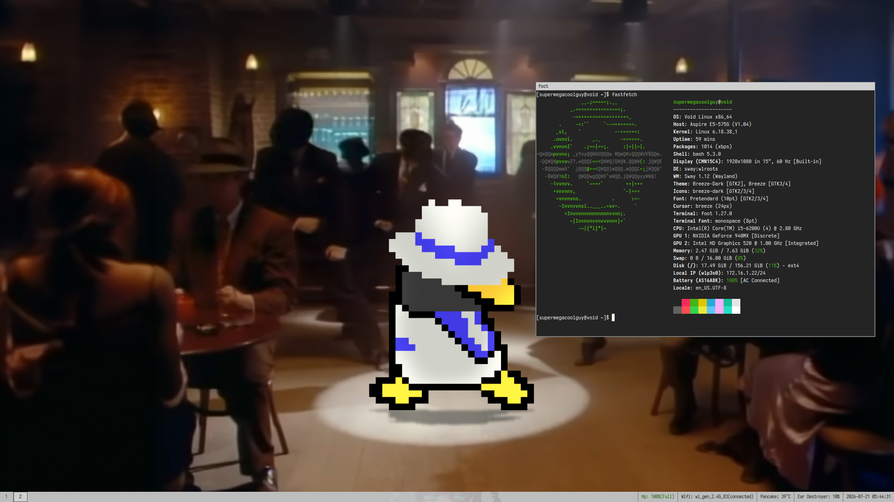

# Rough, but my rice



dependencies(void linux):
 - sway
 - wlroots
 - xdg-desktop-portal
 - xdg-desktop-portal-wlr
 - Breeze theme and cursors
 - mako
 - fcitx5
 - pipewire
 - waybar
 - grimshot
 - grim
 - slurp
 - brightnessctl
 - wmenu
 - Iosevka Term (Font)
 - pactl

## Notes

$screenshots_out must be replaced with a valid directory for the current system.
```ini
set $screenshots_out ~/Pictures/Screenshots
```
